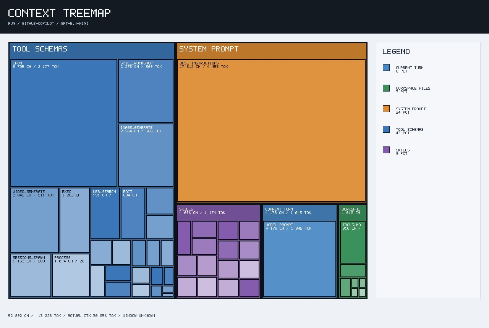
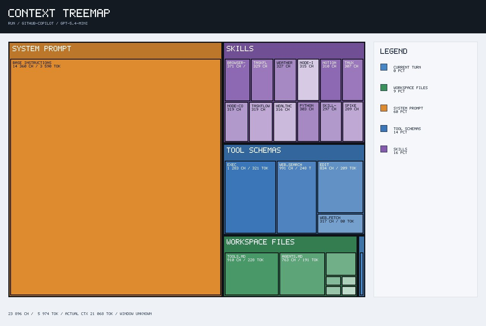
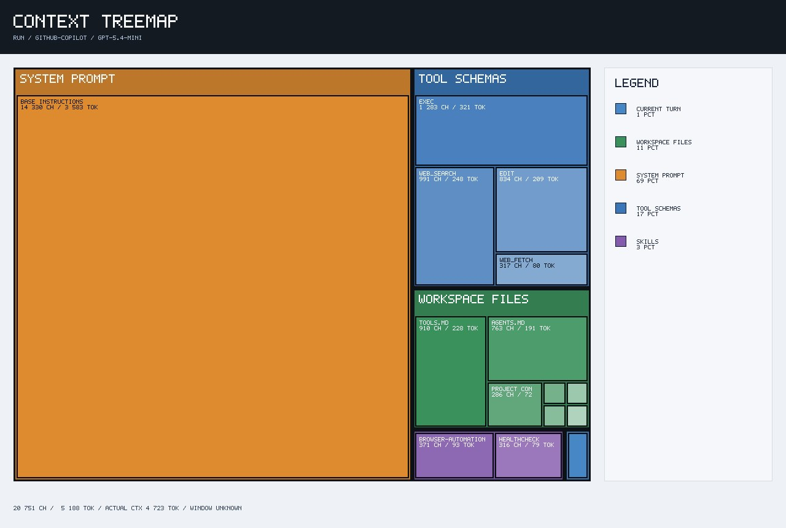

Title: How I Reduced OpenClaw Token Usage by Tightening Instructions
Date: 2026-06-28 10:00
Author: sdontireddy
Category: AI
Tags: AI, OpenClaw , Optimize
Slug: openclaw-reduce-token-usage
Status: published

# How I Reduced OpenClaw Token Usage by Tightening Instructions

While running OpenClaw on a VPS, I started noticing high token usage, slower responses, and occasional token-per-minute pressure from the model provider. At first, I assumed the issue was mainly caused by my workspace instruction files like `AGENTS.md`, `SOUL.md`, `TOOLS.md`, `USER.md`, and `IDENTITY.md`.

But after using OpenClaw’s context treemap, I realized the biggest token consumers were not just my own instructions. A large part of the context was coming from **tool schemas**, enabled **skills**, and OpenClaw’s built-in runtime/system prompt.

This post summarizes how I reduced the context size by disabling extra workspace files, consolidating instructions into `AGENTS.md`, limiting tools, and reducing enabled skills.

---

## Starting Point: High Context Usage

In the initial context treemap, tool schemas were taking almost half of the tracked context.

**Initial context breakdown:**

```text
Tracked context: ~13,223 tokens
Actual context: ~30,056 tokens

Tool Schemas: ~47%
System Prompt: ~34%
Skills: ~9%
Current Turn: ~8%
Workspace Files: ~3%
```

This showed that OpenClaw was exposing many tools to the model, even when I was asking simple questions.

Some of the visible tools included:

```text
cron
skill_workshop
image_generate
video_generate
sessions_spawn
process
exec
web_search
edit
```

For my use case, I did not need all of those tools. I mainly wanted OpenClaw for:

```text
Simple Q&A
Web search
Basic VPS/config work
Occasional file edits
```



---

## Step 1: Disabling Extra Workspace Context Files

The first cleanup step was to reduce the number of workspace instruction files that OpenClaw could load into the context.

I disabled these files:

```text
SOUL.md
TOOLS.md
USER.md
IDENTITY.md
```

Instead of spreading behavior across multiple files, I consolidated the important rules into one file:

```text
AGENTS.md
```

This made the setup easier to reason about. It also reduced unnecessary baseline context from files that were not critical for my current workflow.

The goal was to keep OpenClaw focused:

```text
One main instruction file
Minimal behavior rules
No extra persona or profile files
No unnecessary workspace context
```

---

## Step 2: Adding a Strict Tool Policy in `AGENTS.md`

The biggest visible improvement came from tightening tool access in `AGENTS.md`.

I added a clear tool access policy:

```md
## Tool Access Policy

To reduce context size and avoid large tool schemas, use only the minimum required tools.

Allowed tools:

- web_search
- web_fetch
- exec
- edit

Do not use these tools unless I explicitly ask:

- cron
- skill_workshop
- image_generate
- video_generate
- sessions_spawn
- process

Rules:

- For normal questions, answer directly without tools.
- For web questions, use only web_search and web_fetch.
- For VPS/config tasks, use only exec and edit.
- Do not call image, video, cron, session, process, or skill workshop tools.
- If a blocked tool seems useful, ask me before using it.
```

This reduced the number of tool schemas OpenClaw exposed to the model.

Before this change, the tool schema section was the biggest context block. After the change, only the tools I actually needed remained visible:

```text
exec
web_search
edit
web_fetch
```

---

## Result After Tool Reduction

After disabling extra workspace files and tightening `AGENTS.md`, the context treemap improved significantly.

**Before:**

```text
Tracked context: ~13,223 tokens
Actual context: ~30,056 tokens
Tool Schemas: ~47%
```

**After first optimization:**

```text
Tracked context: ~5,974 tokens
Actual context: ~21,068 tokens
Tool Schemas: ~14%
```

The biggest win was this:

```text
Tool Schemas dropped from ~47% to ~14%
```

That confirmed the main issue was not just the text inside my prompt. The model was carrying too many tool definitions.



---

## Step 3: Reducing Enabled Skills

After reducing tool schemas, the next major block was **Skills**.

The context treemap still showed enabled skills such as:

```text
browser
taskflow
weather
node-i
notion
tmux
node-code
healthcheck
python
spike
```

For my minimal VPS setup, I did not need most of these.

After reducing the enabled skills, the context improved again.

**Updated context breakdown:**

```text
Tracked context: ~5,188 tokens
Actual context: ~4,723 tokens

System Prompt: ~69%
Tool Schemas: ~17%
Workspace Files: ~11%
Skills: ~3%
Current Turn: ~1%
```

This was a major improvement because the **actual context** dropped sharply.

**Before:**

```text
Actual context: ~30,056 tokens
```

**After:**

```text
Actual context: ~4,723 tokens
```

That means each model request became much smaller, which should help with:

```text
Lower token usage
Lower latency
Lower TPM pressure
Fewer stream disconnects
Fewer rate-limit errors
```



---

## Tracked Context vs Actual Context

One important lesson was the difference between **tracked context** and **actual context**.

Tracked context is what OpenClaw can categorize in the treemap, such as:

```text
System Prompt
Tool Schemas
Skills
Workspace Files
Current Turn
```

Actual context is the full request payload that reaches the model. It can include extra runtime wrappers, framework instructions, provider formatting, tool protocol overhead, and session state.

So the treemap is not always a perfect full accounting, but it is extremely useful for identifying where the visible context pressure is coming from.

In my case, the treemap helped me identify the biggest token consumers in this order:

```text
1. Tool schemas
2. Skills
3. Workspace files
4. Current turn
```

---

## What Worked Best

The most effective changes were:

```text
1. Disabled extra workspace files:
   - SOUL.md
   - TOOLS.md
   - USER.md
   - IDENTITY.md

2. Consolidated key behavior into AGENTS.md

3. Added explicit allowed tools:
   - web_search
   - web_fetch
   - exec
   - edit

4. Blocked unnecessary tools:
   - cron
   - skill_workshop
   - image_generate
   - video_generate
   - sessions_spawn
   - process

5. Reduced enabled skills

6. Started fresh sessions after config changes
```

---

## Final Result

The final improvement was significant.

```text
Initial actual context: ~30,056 tokens
Final actual context:   ~4,723 tokens
```

That is a major reduction in the real request size going to the model.

The tracked context also dropped:

```text
Initial tracked context: ~13,223 tokens
Final tracked context:   ~5,188 tokens
```

The biggest visible improvement came from reducing tool schemas:

```text
Tool Schemas before: ~47%
Tool Schemas after:  ~17%
```

And skills were reduced from a noticeable context block to a small one:

```text
Skills after optimization: ~3%
```

---

## Final Takeaway

If OpenClaw is using too many tokens, do not only look at the user prompt. Check the context treemap.

In my case, the prompt itself was not the main problem. The large token usage came from:

```text
Too many visible tool schemas
Enabled skills
Extra workspace files
Long-running sessions
Runtime/system overhead
```

By disabling unnecessary workspace files, consolidating instructions into `AGENTS.md`, limiting tool access, and reducing skills, I was able to make OpenClaw much lighter for VPS usage.

The biggest lesson:

```text
Reducing tokens is not only about writing shorter prompts.
It is about reducing what the agent framework sends with every request.
```

For a minimal OpenClaw setup, my target is now:

```text
Keep AGENTS.md small
Disable extra instruction files
Expose only required tools
Disable unused skills
Start fresh sessions often
Use the context treemap to verify changes
```

This made OpenClaw faster, cheaper, and easier to control.

_Note: ChatGPT helped me structure this post, but the thoughts are based on my own reflections._
